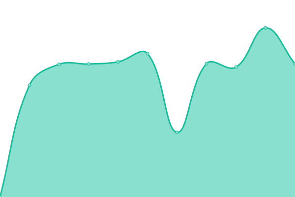
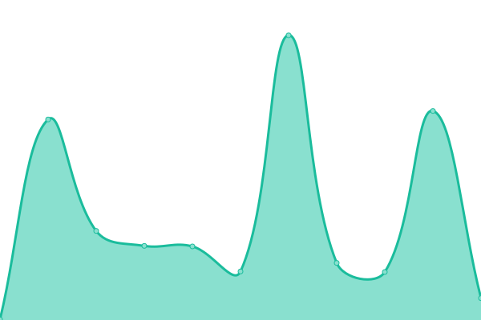
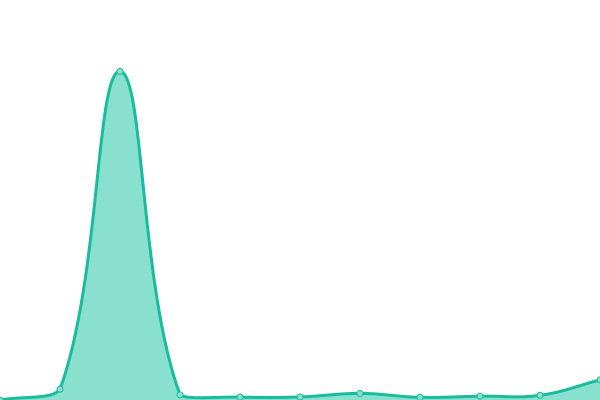
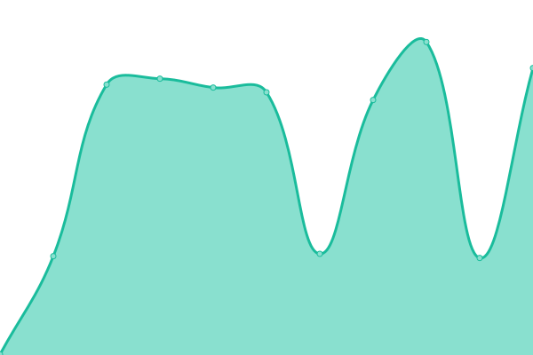

# [📈 Live Status](https://jgamblin.github.io/upptime): <!--live status--> **🟨 Partial outage**

This repository contains the open-source uptime monitor and status page for [Jerry Gamblin](https://www.jerrygamblin.com), powered by [Upptime](https://github.com/upptime/upptime).

With [Upptime](https://upptime.js.org), you can get your own unlimited and free uptime monitor and status page, powered entirely by a GitHub repository. We use [Issues](https://github.com/jgamblin/upptime/issues) as incident reports, [Actions](https://github.com/jgamblin/upptime/actions) as uptime monitors, and [Pages](https://jgamblin.github.io/upptime) for the status page.

<!--start: status pages-->
<!-- This summary is generated by Upptime (https://github.com/upptime/upptime) -->
<!-- Do not edit this manually, your changes will be overwritten -->

| URL                                                          | Status  | History                                                                                                                 | Response Time                                                                                 | Uptime                                                                                                                                                                                                                                             |
| ------------------------------------------------------------ | ------- | ----------------------------------------------------------------------------------------------------------------------- | --------------------------------------------------------------------------------------------- | -------------------------------------------------------------------------------------------------------------------------------------------------------------------------------------------------------------------------------------------------- |
| [JerryGamblin.com](https://www.jerrygamblin.com)             | 🟩 Up   | [jerry-gamblin-com.yml](https://github.com/jgamblin/upptime/commits/master/history/jerry-gamblin-com.yml)               |  2234ms       |                |
| [vulnerablecontainers.org](https://vulnerablecontainers.org) | 🟩 Up   | [vulnerablecontainers-org.yml](https://github.com/jgamblin/upptime/commits/master/history/vulnerablecontainers-org.yml) |  157ms |  |
| [kennaseucurity.com](https://kennaseucurity.com)             | 🟥 Down | [kennaseucurity-com.yml](https://github.com/jgamblin/upptime/commits/master/history/kennaseucurity-com.yml)             |  0ms         |                |
| [Kenna App](https://app.kennaseucurity.com)                  | 🟥 Down | [kenna-app.yml](https://github.com/jgamblin/upptime/commits/master/history/kenna-app.yml)                               |  0ms                  |                                 |

<!--end: status pages-->

[**Visit our status website →**](https://jgamblin.github.io/upptime)

## 📄 License

- Code: [MIT](./LICENSE) © [Jerry Gamblin](https://www.jerrygamblin.com)
- Data in the `./history` directory: [Open Database License](https://opendatacommons.org/licenses/odbl/1-0/)
