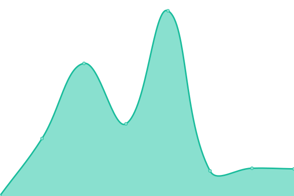
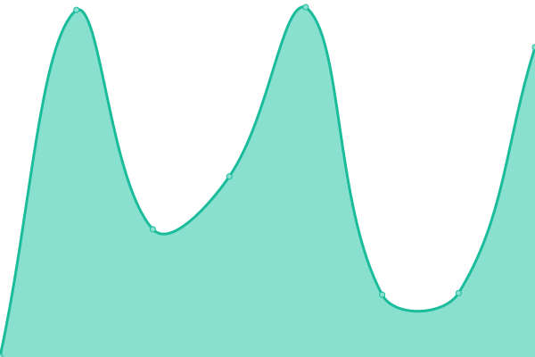

# [📈 Live Status](https://jgamblin.github.io/upptime): <!--live status--> **🟩 All systems operational**

This repository contains the open-source uptime monitor and status page for [Jerry Gamblin](https://www.jerrygamblin.com), powered by [Upptime](https://github.com/upptime/upptime).

With [Upptime](https://upptime.js.org), you can get your own unlimited and free uptime monitor and status page, powered entirely by a GitHub repository. We use [Issues](https://github.com/jgamblin/upptime/issues) as incident reports, [Actions](https://github.com/jgamblin/upptime/actions) as uptime monitors, and [Pages](https://jgamblin.github.io/upptime) for the status page.

<!--start: status pages-->
<!-- This summary is generated by Upptime (https://github.com/upptime/upptime) -->
<!-- Do not edit this manually, your changes will be overwritten -->
<!-- prettier-ignore -->
| URL | Status | History | Response Time | Uptime |
| --- | ------ | ------- | ------------- | ------ |
|  [JerryGamblin.com](https://www.jerrygamblin.com) | 🟩 Up | [jerry-gamblin-com.yml](https://github.com/jgamblin/upptime/commits/HEAD/history/jerry-gamblin-com.yml) | 

 2940ms
     
 | 

<a href="https://jgamblin.github.io/upptime/history/jerry-gamblin-com">100.00%</a>
    

|  [vulnerablecontainers.org](https://vulnerablecontainers.org) | 🟩 Up | [vulnerablecontainers-org.yml](https://github.com/jgamblin/upptime/commits/HEAD/history/vulnerablecontainers-org.yml) | 

 185ms
     
 | 

<a href="https://jgamblin.github.io/upptime/history/vulnerablecontainers-org">100.00%</a>
    

|  [kennaseucurity.com](https://www.kennasecurity.com/) | 🟩 Up | [kennaseucurity-com.yml](https://github.com/jgamblin/upptime/commits/HEAD/history/kennaseucurity-com.yml) | 

 432ms
     
 | 

<a href="https://jgamblin.github.io/upptime/history/kennaseucurity-com">100.00%</a>
    

|  [Kenna App](https://app.kennasecurity.com/) | 🟩 Up | [kenna-app.yml](https://github.com/jgamblin/upptime/commits/HEAD/history/kenna-app.yml) | 

 392ms
     
 | 

<a href="https://jgamblin.github.io/upptime/history/kenna-app">100.00%</a>
    

<!--end: status pages-->

[**Visit our status website →**](https://jgamblin.github.io/upptime)

## 📄 License

- Code: [MIT](./LICENSE) © [Jerry Gamblin](https://www.jerrygamblin.com)
- Data in the `./history` directory: [Open Database License](https://opendatacommons.org/licenses/odbl/1-0/)
